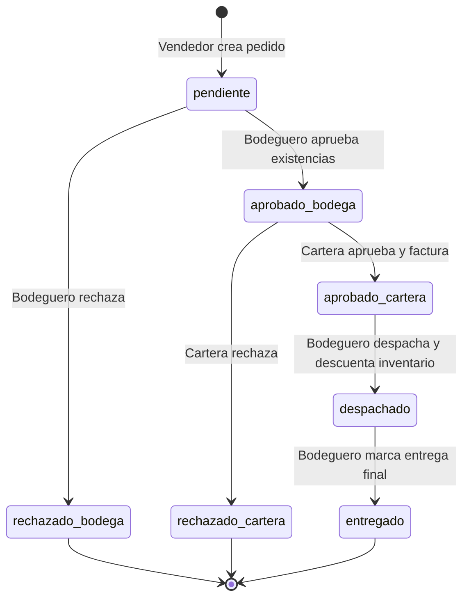

# Contexto Integral del Proyecto: Mobulaa

Documentación técnica y funcional del proyecto para traspaso de conocimiento. Este documento describe la arquitectura, rutas, modelo de datos, lógica de negocio e integraciones basándose exclusivamente en el código fuente.

---

## 1. Estructura

Árbol de directorios y archivos de las carpetas `app/`, `components/`, `lib/`, `types/` y la raíz del proyecto (excluyendo `node_modules`, `.next` y `.git`):

```text
Mobulaaa/
├── .env.local
├── .gitignore
├── AGENTS.md
├── CLAUDE.md
├── README.md
├── eslint.config.mjs
├── next-env.d.ts
├── next.config.ts
├── package.json
├── package-lock.json
├── postcss.config.mjs
├── proxy.ts
├── tsconfig.json
├── tsconfig.tsbuildinfo
├── public/
│   ├── Logoo.png
│   ├── file.svg
│   ├── globe.svg
│   ├── logo-mobulaa-blanco.png
│   ├── logo-mobulaa.png
│   ├── next.svg
│   ├── vercel.svg
│   └── window.svg
├── app/
│   ├── favicon.ico
│   ├── globals.css
│   ├── layout.tsx
│   ├── page.tsx
│   ├── (auth)/
│   │   ├── layout.tsx
│   │   ├── login/
│   │   │   └── page.tsx
│   │   └── registro/
│   │       └── page.tsx
│   ├── (dashboard)/
│   │   ├── layout.tsx
│   │   ├── admin/
│   │   │   ├── bodegas/
│   │   │   │   └── page.tsx
│   │   │   ├── cortes/
│   │   │   │   ├── [id]/
│   │   │   │   │   └── page.tsx
│   │   │   │   └── page.tsx
│   │   │   ├── estadisticas/
│   │   │   │   └── page.tsx
│   │   │   ├── productos/
│   │   │   │   └── page.tsx
│   │   │   ├── reportes/
│   │   │   │   └── page.tsx
│   │   │   ├── subir-inventario/
│   │   │   │   └── page.tsx
│   │   │   ├── test-descuentos/   (carpeta vacía)
│   │   │   ├── usuarios/
│   │   │   │   └── page.tsx
│   │   │   └── page.tsx
│   │   ├── bodeguero/
│   │   │   ├── entradas/
│   │   │   │   └── page.tsx
│   │   │   ├── inventario/
│   │   │   │   └── page.tsx
│   │   │   ├── movimientos/
│   │   │   │   └── page.tsx
│   │   │   ├── pedidos/
│   │   │   │   └── page.tsx
│   │   │   └── page.tsx
│   │   ├── cartera/
│   │   │   └── page.tsx
│   │   └── vendedor/
│   │       ├── catalogo/
│   │       │   └── page.tsx
│   │       ├── mis-pedidos/
│   │       │   └── page.tsx
│   │       └── page.tsx
│   └── api/
│       └── subir-inventario/
│           └── route.ts
├── components/
│   ├── dashboard/
│   │   └── DashboardContent.tsx
│   └── pedidos/
│       ├── ClienteCard.tsx
│       ├── ClienteNuevoForm.tsx
│       ├── ClienteSelector.tsx
│       ├── HistorialClienteModal.tsx
│       └── ProductoSelector.tsx
├── lib/
│   ├── context/
│   │   ├── NotificacionesContext.tsx
│   │   └── TiendaContext.tsx
│   ├── hooks/
│   │   ├── useBuscarCliente.ts
│   │   ├── useBuscarProducto.ts
│   │   └── useDebounce.ts
│   ├── supabase/
│   │   ├── client.ts
│   │   └── server.ts
│   └── utils/
│       ├──  formatNumbers.ts   (nombre con espacio inicial)
│       └── dataExcel.ts
└── types/
    ├── clientes.ts
    └── index.ts
```

---

## 2. Rutas y Pantallas

Lista de archivos en `app/` con su función y rol autorizado:

| Archivo | Ruta | Descripción | Rol que puede entrar |
|---|---|---|---|
| `app/layout.tsx` | N/A (Root Layout) | Layout raíz; configura viewport, metadata y envuelve la aplicación en `TiendaProvider`. | Público / Todos |
| `app/page.tsx` | `/` | Redirección automática hacia `/login`. | Público |
| `app/(auth)/layout.tsx` | N/A (Auth Layout) | Envoltorio para pantallas de autenticación con fondo y márgenes seguros para móvil. | Público |
| `app/(auth)/login/page.tsx` | `/login` | Formulario de autenticación por email y contraseña; consulta el rol y redirige al panel correspondiente. | Público (no autenticados) |
| `app/(auth)/registro/page.tsx` | `/registro` | Formulario de registro público; crea usuario en Supabase Auth y registro en tabla `usuarios` con rol `vendedor`. | Público (no autenticados) |
| `app/(dashboard)/layout.tsx` | N/A (Dashboard Layout) | Layout protegido del panel; valida sesión activa, carga rol e ID, y monta `NotificacionesProvider` y `DashboardContent`. | Autenticados (cualquier rol) |
| `app/(dashboard)/admin/page.tsx` | `/admin` | Panel de control de administrador con KPIs globales del sistema y métricas específicas de la tienda activa. | `admin` |
| `app/(dashboard)/admin/bodegas/page.tsx` | `/admin/bodegas` | Gestión CRUD de tiendas y bodegas físicas (crear, editar, borrado lógico). | `admin` |
| `app/(dashboard)/admin/cortes/page.tsx` | `/admin/cortes` | Listado histórico de conteos físicos de inventario por bodega, con totales de faltantes y sobrantes. | `admin` |
| `app/(dashboard)/admin/cortes/[id]/page.tsx` | `/admin/cortes/[id]` | Vista detallada de un corte/conteo con discrepancias entre stock de sistema y stock físico por producto. | `admin` |
| `app/(dashboard)/admin/estadisticas/page.tsx` | `/admin/estadisticas` | Tablero de analítica visual con gráficos Recharts (stock por categoría, movimientos temporales y KPIs). | `admin` |
| `app/(dashboard)/admin/productos/page.tsx` | `/admin/productos` | Gestión de catálogo de productos (creación con stock inicial por bodega, edición y desactivación). | `admin` |
| `app/(dashboard)/admin/reportes/page.tsx` | `/admin/reportes` | Reportes filtrables por fecha: total facturado, movimientos por tipo, vendedores top y productos más pedidos. | `admin` |
| `app/(dashboard)/admin/subir-inventario/page.tsx` | `/admin/subir-inventario` | Formulario para cargar y procesar archivos Excel (.xlsx/.xls) masivos de inventario para una bodega. | `admin` |
| `app/(dashboard)/admin/usuarios/page.tsx` | `/admin/usuarios` | Administración de usuarios del sistema (edición de datos, asignación de tienda y desactivación). | `admin` |
| `app/(dashboard)/bodeguero/page.tsx` | `/bodeguero` | Panel inicial de bodeguero con tarjetas de pedidos pendientes, productos bajo stock mínimo y total de stock. | `bodeguero` (y `admin`) |
| `app/(dashboard)/bodeguero/entradas/page.tsx` | `/bodeguero/entradas` | Formulario para registrar entradas manuales de mercancía, sumando stock en inventario y generando movimiento. | `bodeguero` (y `admin`) |
| `app/(dashboard)/bodeguero/inventario/page.tsx` | `/bodeguero/inventario` | Consulta de inventario de la bodega actual con buscador por nombre/código y filtro por categoría. | `bodeguero` (y `admin`) |
| `app/(dashboard)/bodeguero/movimientos/page.tsx` | `/bodeguero/movimientos` | Historial de movimientos de inventario (entradas, salidas, transferencias) por rangos de días (7, 30, 90). | `bodeguero` (y `admin`) |
| `app/(dashboard)/bodeguero/pedidos/page.tsx` | `/bodeguero/pedidos` | Gestión operativa de pedidos: aprobación/rechazo de bodega, edición de cantidades y despacho físico. | `bodeguero` (y `admin`) |
| `app/(dashboard)/cartera/page.tsx` | `/cartera` | Gestión de cartera: revisión de pedidos aprobados por bodega, cálculo de descuentos, facturación y rechazo. | `cartera` (y `admin`) |
| `app/(dashboard)/vendedor/page.tsx` | `/vendedor` | Pantalla de inicio de vendedor con listado de pedidos y modal para crear nuevo pedido en 2 pasos. | `vendedor` |
| `app/(dashboard)/vendedor/catalogo/page.tsx` | `/vendedor/catalogo` | Catálogo visual de productos con existencias disponibles en la bodega seleccionada para el vendedor. | `vendedor` |
| `app/(dashboard)/vendedor/mis-pedidos/page.tsx` | `/vendedor/mis-pedidos` | Vista completa optimizada para móvil de gestión y creación de pedidos del vendedor. | `vendedor` (y `admin`) |
| `app/api/subir-inventario/route.ts` | `/api/subir-inventario` (POST) | API Route handler que procesa archivos Excel, normaliza datos y actualiza `categorias`, `productos` e `inventario`. | Autenticados / Admin (inferido) |

> **Nota sobre Server Actions**: No existen Server Actions (`'use server'`) en el proyecto. Todas las mutaciones se realizan vía cliente Supabase o mediante la ruta de API `app/api/subir-inventario/route.ts`.

---

## 3. Roles y Autenticación

### Roles Existentes
- **`admin`**: Administrador del sistema. Tiene acceso a configuración, usuarios, bodegas, reportes, estadísticas y a las vistas operativas de los demás roles.
- **`bodeguero`**: Encargado de almacén. Gestiona entradas de mercancía, revisa inventario físico, aprueba existencias de pedidos y ejecuta despachos.
- **`cartera`**: Encargado financiero. Revisa pedidos pre-aprobados por bodega, aplica políticas de descuentos comerciales, aprueba generando número de factura o rechaza pedidos.
- **`vendedor`**: Asesor comercial. Consulta catálogo con stock en tiempo real, busca o registra clientes, y monta pedidos para sus clientes.

### Validación de Autenticación y Autorización
1. **Middleware / Proxy (`proxy.ts`)**:
   - Se ejecuta en cada petición (según el matcher que excluye archivos estáticos).
   - Crea un cliente Supabase de servidor con `@supabase/ssr` leyendo las cookies de la solicitud.
   - Valida la sesión con `supabase.auth.getUser()`.
   - **Regla 1 (No autenticado)**: Si no hay usuario y la ruta no inicia con `/login` ni `/registro`, redirige forzosamente a `/login`.
   - **Regla 2 (Autenticado en ruta de auth)**: Si hay usuario y visita `/login` o `/registro`, consulta la tabla `usuarios` por su `id` y lo redirige a su panel inicial:
     - `admin` $\rightarrow$ `/admin`
     - `bodeguero` $\rightarrow$ `/bodeguero`
     - `cartera` $\rightarrow$ `/cartera`
     - `vendedor` (o cualquier otro) $\rightarrow$ `/vendedor`
   - *(Observación de seguridad)*: `proxy.ts` no valida si un usuario con rol `vendedor` ingresa manualmente a una URL como `/admin` por navegador.
2. **Layout Protegido (`app/(dashboard)/layout.tsx`)**:
   - En el cliente, comprueba `supabase.auth.getSession()`. Si no hay sesión o falla la consulta a la tabla `usuarios`, redirige a `/login`.
   - Carga el rol y el `user.id`, pasando estas propiedades a `NotificacionesProvider` y a `DashboardContent`.
3. **Navegación Visual por Rol (`components/dashboard/DashboardContent.tsx`)**:
   - Define el objeto `navigationConfig` con los enlaces y títulos autorizados para cada rol (`admin`, `bodeguero`, `cartera`, `vendedor`), filtrando los botones del menú lateral según el rol del usuario conectado.
4. **Registro de Usuarios (`app/(auth)/registro/page.tsx`)**:
   - Crea el usuario en Supabase Auth (`supabase.auth.signUp`).
   - Inserta un registro en la tabla `usuarios` asignando automáticamente el rol `vendedor`.
5. **Políticas RLS (Row Level Security)**:
   - No existen archivos de migración ni sentencias SQL de RLS dentro del repositorio. Las políticas de seguridad a nivel de fila están configuradas directamente en el proyecto de Supabase en la nube (inferido).

---

## 4. Modelo de Datos

### Contenido Completo de Archivos en `types/`

#### `types/clientes.ts`
```typescript
export interface Cliente {
  id: string
  cc_nit: string
  nombre: string
  telefono: string | null
  email: string | null
  direccion: string | null
  activo: boolean | null
  fecha_registro: string | null
}

export interface PedidoHistorial {
  id: string
  fecha: string
  estado: string
  total: number
  numero_factura: string | null
}

export type EstadoBusquedaCliente =
  | 'idle'
  | 'escribiendo'
  | 'buscando'
  | 'encontrado'
  | 'no_encontrado'
  | 'error'
```

#### `types/index.ts`
```typescript
export type Rol = 'admin' | 'bodeguero' | 'vendedor' | 'cartera'

export type EstadoPedido = 'pendiente' | 'aprobado_bodega' | 'rechazado_bodega' | 'aprobado_cartera' | 'rechazado_cartera' | 'despachado' | 'entregado'
export interface Usuario {
  id: string
  nombre: string
  email: string
  rol: Rol
  bodega_id?: string
  activo: boolean
}

export interface Bodega {
  id: string
  nombre: string
  direccion: string
  tipo: 'principal' | 'secundaria'
  activo: boolean
}

export interface Producto {
  id: string
  nombre: string
  descripcion: string
  categoria: string
  codigo: string
  precio: number
  activo: boolean
}

export interface Inventario {
  id: string
  producto_id: string
  bodega_id: string
  cantidad_disponible: number
  cantidad_minima: number
}

export interface Movimiento {
  id: string
  producto_id: string
  bodega_origen_id?: string
  bodega_destino_id?: string
  cantidad: number
  tipo: 'entrada' | 'salida' | 'traslado'
  usuario_id: string
  fecha: string
  observacion?: string
}

export interface DetallePedido {
  id: string
  pedido_id: string
  producto_id: string
  cantidad_solicitada: number
  cantidad_aprobada?: number
}

export interface Pedido {
  id: string
  vendedor_id: string
  bodega_id: string
  estado: EstadoPedido
  fecha: string
  observacion?: string
  subtotal: number
  descuento_porcentaje: number
  descuento_valor: number
  total: number
  numero_factura?: string
}

export const DESCUENTOS = [
  { minimo: 5000000, porcentaje: 10 },
  { minimo: 2000000, porcentaje: 5 },
  { minimo: 1000000, porcentaje: 3 },
]

export const calcularDescuento = (subtotal: number): number => {
  const descuento = DESCUENTOS.find(d => subtotal >= d.minimo)
  return descuento?.porcentaje || 0
}

export const CATEGORIAS = [
  'AUDIFONO', 'CARGADOR', 'CABLES', 'RELOJ', 'PARLANTES', 
  'DIADEMAS', 'POWER BANK', 'CELULAR', 'TABLET', 'COMPUTADOR', 
  'VENTILADOR', 'OTROS'
]
```

---

### Tablas de Supabase Consultadas en el Código

1. **`usuarios`**:
   - **Campos**: `id` (PK, UUID ligado a `auth.users`), `nombre` (text), `email` (text), `rol` (text: 'admin', 'bodeguero', 'cartera', 'vendedor'), `bodega_id` (UUID, nullable), `activo` (boolean).
   - **Relaciones**: `bodega_id` referencia a `bodegas.id`. Referenciada por `pedidos.vendedor_id` y `movimientos.usuario_id`.
2. **`bodegas`**:
   - **Campos**: `id` (PK, UUID), `nombre` (text), `direccion` (text), `tipo` (text: 'principal' | 'secundaria'), `activo` (boolean).
   - **Relaciones**: Referenciada por `usuarios.bodega_id`, `inventario.bodega_id`, `pedidos.bodega_id`, `movimientos.bodega_origen_id`, `movimientos.bodega_destino_id`, `cortes.bodega_id`.
3. **`productos`**:
   - **Campos**: `id` (PK, UUID), `nombre` (text), `descripcion` (text, usada también para guardar color), `categoria` (text), `categoria_id` (UUID, nullable), `codigo` (text, único), `marca` (text, opcional), `precio` (numeric), `sku` (text, opcional), `activo` (boolean). *En consultas puntuales de detalle de cortes se consultan también `color` y `modelo` (inferido como columnas adicionales o metadatos).*
   - **Relaciones**: `categoria_id` referencia a `categorias.id`. Referenciada por `inventario.producto_id`, `detalle_pedido.producto_id`, `movimientos.producto_id`, `detalle_cortes.producto_id`.
4. **`categorias`**:
   - **Campos**: `id` (PK, UUID), `nombre` (text, único).
   - **Relaciones**: Referenciada por `productos.categoria_id`.
5. **`inventario`**:
   - **Campos**: `id` (PK, UUID), `producto_id` (UUID FK), `bodega_id` (UUID FK), `cantidad_disponible` (integer), `cantidad_minima` (integer).
   - **Relaciones / Constraints**: Clave única compuesta sobre `(producto_id, bodega_id)`. FK a `productos.id` y `bodegas.id`.
6. **`clientes`**:
   - **Campos**: `id` (PK, UUID), `cc_nit` (text, único), `nombre` (text), `telefono` (text, nullable), `email` (text, nullable), `direccion` (text, nullable), `activo` (boolean, nullable), `fecha_registro` (timestamp, nullable).
   - **Relaciones**: Referenciada por `pedidos.cliente_id`.
7. **`pedidos`**:
   - **Campos**: `id` (PK, UUID), `vendedor_id` (UUID FK), `bodega_id` (UUID FK), `cliente_id` (UUID FK), `estado` (text: 'pendiente', 'aprobado_bodega', 'rechazado_bodega', 'aprobado_cartera', 'rechazado_cartera', 'despachado', 'entregado'), `fecha` (timestamp/text), `observacion` (text, nullable), `subtotal` (numeric), `descuento_porcentaje` (numeric), `descuento_valor` (numeric), `total` (numeric), `numero_factura` (text, nullable).
   - **Relaciones**: FK a `usuarios.id`, `bodegas.id`, `clientes.id`. Referenciada por `detalle_pedido.pedido_id`.
8. **`detalle_pedido`**:
   - **Campos**: `id` (PK, UUID), `pedido_id` (UUID FK), `producto_id` (UUID FK), `cantidad_solicitada` (integer), `cantidad_aprobada` (integer, nullable).
   - **Relaciones**: FK a `pedidos.id` y `productos.id`.
9. **`movimientos`**:
   - **Campos**: `id` (PK, UUID), `producto_id` (UUID FK), `bodega_origen_id` (UUID FK, nullable), `bodega_destino_id` (UUID FK, nullable), `cantidad` (integer), `tipo` (text: 'entrada', 'salida', 'traslado' o 'transferencia'), `usuario_id` (UUID FK), `fecha` (timestamp/text), `observacion` (text, nullable).
   - **Relaciones**: FK a `productos.id`, `bodegas.id`, `usuarios.id`.
10. **`cortes`**:
    - **Campos**: `id` (PK, UUID), `bodega_id` (UUID FK), `fecha` (timestamp/text), `estado` (text), `observaciones` (text, nullable).
    - **Relaciones**: FK a `bodegas.id`. Referenciada por `detalle_cortes.corte_id`.
11. **`detalle_cortes`**:
    - **Campos**: `id` (PK, UUID), `corte_id` (UUID FK), `producto_id` (UUID FK), `cantidad_sistema` (integer), `cantidad_fisica` (integer), `diferencia` (integer), `observacion` (text, nullable).
    - **Relaciones**: FK a `cortes.id` y `productos.id`.

---

## 5. Funcionalidades por Rol

### Rol: `admin`

- **Dashboard Principal** ([`app/(dashboard)/admin/page.tsx`](file:///c:/Users/juaan/OneDrive/Escritorio/Mobulaa%20proyecto/Mobulaaa/app/(dashboard)/admin/page.tsx)):
  - **Consultas**: Conteo exacto de productos activos, bodegas activas, usuarios activos; conteo de pedidos pendientes, productos bajo mínimo y movimientos del día para la tienda activa.
  - **Botones / Navegación**: Enlaces a productos, bodegas, usuarios, pedidos de bodega, inventario y movimientos.
- **Gestión de Bodegas** ([`app/(dashboard)/admin/bodegas/page.tsx`](file:///c:/Users/juaan/OneDrive/Escritorio/Mobulaa%20proyecto/Mobulaaa/app/(dashboard)/admin/bodegas/page.tsx)):
  - **Consultas**: Listado de bodegas con `activo = true` ordenadas alfabéticamente.
  - **Formularios**: Modal con campos `nombre`, `direccion` y selector `tipo` ('principal' \| 'secundaria').
  - **Inserciones**: Inserción de nueva bodega (`activo: true`).
  - **Actualizaciones**: Edición de datos de bodega existente.
  - **Eliminaciones**: Borrado lógico actualizando `{ activo: false }`.
- **Gestión de Productos** ([`app/(dashboard)/admin/productos/page.tsx`](file:///c:/Users/juaan/OneDrive/Escritorio/Mobulaa%20proyecto/Mobulaaa/app/(dashboard)/admin/productos/page.tsx)):
  - **Consultas**: Listado de productos activos y bodegas activas.
  - **Formularios**: Modal con `codigo`, `nombre`, `color`, `categoria`, `bodega_id` y `cantidad inicial`.
  - **Inserciones**: Crea producto en `productos`; si se indica bodega y cantidad, inserta el registro inicial en `inventario`.
  - **Actualizaciones**: Edición de `nombre`, `categoria`, `codigo` y `descripcion`.
  - **Eliminaciones**: Borrado lógico actualizando `productos` con `{ activo: false }`.
- **Gestión de Usuarios** ([`app/(dashboard)/admin/usuarios/page.tsx`](file:///c:/Users/juaan/OneDrive/Escritorio/Mobulaa%20proyecto/Mobulaaa/app/(dashboard)/admin/usuarios/page.tsx)):
  - **Consultas**: Listado de usuarios activos con el nombre de su bodega asignada.
  - **Formularios**: Modal de edición de usuario (`nombre`, `email`, `rol`: 'admin' \| 'bodeguero' \| 'vendedor', `bodega_id`).
  - **Actualizaciones**: Modifica perfil y rol en `usuarios`.
  - **Eliminaciones**: Desactivación lógica actualizando `{ activo: false }`.
- **Gestión y Consulta de Cortes** ([`app/(dashboard)/admin/cortes/page.tsx`](file:///c:/Users/juaan/OneDrive/Escritorio/Mobulaa%20proyecto/Mobulaaa/app/(dashboard)/admin/cortes/page.tsx) y [`app/(dashboard)/admin/cortes/[id]/page.tsx`](file:///c:/Users/juaan/OneDrive/Escritorio/Mobulaa%20proyecto/Mobulaaa/app/(dashboard)/admin/cortes/[id]/page.tsx)):
  - **Consultas**: Listado de cortes de la bodega activa; cálculo dinámico de faltantes, sobrantes y sin diferencias desde `detalle_cortes`. Detalle individual por producto (stock sistema vs físico vs diferencia).
  - **Botones / Navegación**: Enlaces a detalle del corte y botón para subir nuevo conteo.
- **Importación Masiva de Inventario (Excel)** ([`app/(dashboard)/admin/subir-inventario/page.tsx`](file:///c:/Users/juaan/OneDrive/Escritorio/Mobulaa%20proyecto/Mobulaaa/app/(dashboard)/admin/subir-inventario/page.tsx) y [`app/api/subir-inventario/route.ts`](file:///c:/Users/juaan/OneDrive/Escritorio/Mobulaa%20proyecto/Mobulaaa/app/api/subir-inventario/route.ts)):
  - **Formularios / Archivo**: Selector de bodega y zona drag & drop para archivos `.xlsx` y `.xls`.
  - **Procesamiento Backend**: Lectura de todas las hojas del libro Excel con `xlsx`, limpieza ortográfica, unificación de duplicados y normalización de marcas/categorías mediante [`dataExcel.ts`](file:///c:/Users/juaan/OneDrive/Escritorio/Mobulaa%20proyecto/Mobulaaa/lib/utils/dataExcel.ts).
  - **Inserciones / Upserts**: Upsert en `categorias` por nombre, upsert en `productos` por `codigo`, y upsert en `inventario` por `(producto_id, bodega_id)`.
  - **Salida**: Resumen visual con total de procesados, errores detallados y duplicados unificados.
- **Reportes** ([`app/(dashboard)/admin/reportes/page.tsx`](file:///c:/Users/juaan/OneDrive/Escritorio/Mobulaa%20proyecto/Mobulaaa/app/(dashboard)/admin/reportes/page.tsx)):
  - **Filtros**: Rango de fechas (`fechaDesde` y `fechaHasta`).
  - **Consultas y Métricas**: Total facturado en pedidos aprobados por cartera, resumen de movimientos agrupados por tipo (entrada, salida, traslado), ranking de vendedores por valor total de ventas, y top 10 productos más pedidos.
- **Estadísticas y Gráficas** ([`app/(dashboard)/admin/estadisticas/page.tsx`](file:///c:/Users/juaan/OneDrive/Escritorio/Mobulaa%20proyecto/Mobulaaa/app/(dashboard)/admin/estadisticas/page.tsx)):
  - **Filtros**: Selector de periodo (7, 30, 90 días).
  - **Gráficas**:
    - `BarChart` (Recharts): Stock por categoría ordenado de mayor a menor.
    - `LineChart` (Recharts): Tendencia de movimientos diarios clasificados en Entradas, Salidas y Transferencias.
  - **KPIs**: Tarjetas de productos totales, unidades disponibles, productos bajo mínimo y agotados.
  - **Listados**: Tarjeta de último corte con métricas de discrepancias, top 5 productos con mayor movimiento, lista de pedidos prioritarios y timeline de actividad reciente.

---

### Rol: `bodeguero`

- **Panel de Inicio** ([`app/(dashboard)/bodeguero/page.tsx`](file:///c:/Users/juaan/OneDrive/Escritorio/Mobulaa%20proyecto/Mobulaaa/app/(dashboard)/bodeguero/page.tsx)):
  - **Consultas**: Conteo de pedidos pendientes, productos bajo stock mínimo y total de referencias en la bodega activa.
- **Consulta de Inventario** ([`app/(dashboard)/bodeguero/inventario/page.tsx`](file:///c:/Users/juaan/OneDrive/Escritorio/Mobulaa%20proyecto/Mobulaaa/app/(dashboard)/bodeguero/inventario/page.tsx)):
  - **Consultas**: Stock disponible y stock mínimo de cada producto en la bodega actual.
  - **Filtros**: Búsqueda en vivo por nombre/código y filtro desplegable por categoría.
  - **Indicadores**: Badge visual "Stock bajo" cuando `cantidad_disponible <= cantidad_minima` vs "OK".
- **Entrada de Mercancía** ([`app/(dashboard)/bodeguero/entradas/page.tsx`](file:///c:/Users/juaan/OneDrive/Escritorio/Mobulaa%20proyecto/Mobulaaa/app/(dashboard)/bodeguero/entradas/page.tsx)):
  - **Formulario**: Búsqueda asistida de producto por texto o categoría, campo numérico de cantidad entrante y observación opcional.
  - **Inserciones / Actualizaciones**: Inserta registro en `movimientos` (`tipo: 'entrada'`) y actualiza o inserta en `inventario` sumando la cantidad disponible a la bodega activa.
- **Historial de Movimientos** ([`app/(dashboard)/bodeguero/movimientos/page.tsx`](file:///c:/Users/juaan/OneDrive/Escritorio/Mobulaa%20proyecto/Mobulaaa/app/(dashboard)/bodeguero/movimientos/page.tsx)):
  - **Consultas**: Últimos 50 movimientos donde la bodega activa sea origen o destino en los últimos 7, 30 o 90 días.
  - **Métricas**: Totales acumulados de unidades entradas, salidas y transferidas.
- **Gestión Operativa de Pedidos** ([`app/(dashboard)/bodeguero/pedidos/page.tsx`](file:///c:/Users/juaan/OneDrive/Escritorio/Mobulaa%20proyecto/Mobulaaa/app/(dashboard)/bodeguero/pedidos/page.tsx)):
  - **Revisión de Pedidos Pendientes**:
    - Consulta pedidos en estado `pendiente`.
    - Botón "Editar": Permite modificar las cantidades solicitadas (`detalle_pedido.cantidad_solicitada`) si no hay suficiente existencia.
    - Botón "Aprobar y enviar a cartera": Actualiza el estado a `aprobado_bodega`.
    - Botón "Rechazar": Actualiza el estado a `rechazado_bodega`.
  - **Despacho de Pedidos**:
    - Consulta pedidos listos en estado `aprobado_cartera`.
    - Botón "Despachar pedido": Abre formulario para confirmar las cantidades despachadas (`cantidad_aprobada`).
    - Botón "Confirmar despacho": Actualiza `cantidad_aprobada` en `detalle_pedido`, descuenta stock de `inventario`, inserta movimiento tipo `salida` en `movimientos`, y cambia estado del pedido a `despachado`.
  - **Entrega Final**:
    - Botón "Marcar entregado": Para pedidos en estado `despachado`, actualiza el estado a `entregado`.

---

### Rol: `cartera`

- **Aprobación y Facturación de Pedidos** ([`app/(dashboard)/cartera/page.tsx`](file:///c:/Users/juaan/OneDrive/Escritorio/Mobulaa%20proyecto/Mobulaaa/app/(dashboard)/cartera/page.tsx)):
  - **Consultas**: Pedidos de la bodega activa con join a vendedor y detalles con precios unitarios de productos.
  - **Cálculo Automático**: Subtotal, porcentaje de descuento comercial aplicado según escala de ventas, valor del descuento y total a pagar.
  - **Botón "Aprobar y generar factura"**:
    - Genera número de factura secuencial con patrón `FAC-YYYY-XXXXX`.
    - Actualiza el pedido a `aprobado_cartera` guardando `subtotal`, `descuento_porcentaje`, `descuento_valor`, `total` y `numero_factura`.
  - **Botón "Rechazar"**:
    - Actualiza el estado del pedido a `rechazado_cartera`.
  - **Historial**: Consulta de pedidos en cualquier otro estado (`aprobado_cartera`, `rechazado_cartera`, `despachado`, `entregado`, etc.).

---

### Rol: `vendedor`

- **Catálogo de Productos** ([`app/(dashboard)/vendedor/catalogo/page.tsx`](file:///c:/Users/juaan/OneDrive/Escritorio/Mobulaa%20proyecto/Mobulaaa/app/(dashboard)/vendedor/catalogo/page.tsx)):
  - **Consultas**: Productos con existencias disponibles (`cantidad_disponible > 0`) en la bodega seleccionada.
  - **Filtros**: Buscador por texto y selector de categoría.
- **Mis Pedidos y Creación de Pedidos** ([`app/(dashboard)/vendedor/page.tsx`](file:///c:/Users/juaan/OneDrive/Escritorio/Mobulaa%20proyecto/Mobulaaa/app/(dashboard)/vendedor/page.tsx) y [`app/(dashboard)/vendedor/mis-pedidos/page.tsx`](file:///c:/Users/juaan/OneDrive/Escritorio/Mobulaa%20proyecto/Mobulaaa/app/(dashboard)/vendedor/mis-pedidos/page.tsx)):
  - **Consultas**: Pedidos creados por el vendedor autenticado en la bodega actual, con barra visual de estados (`EstadoBarra`).
  - **Flujo de Creación de Pedido (Modal en 2 Pasos)**:
    - **Paso 1: Identificación del Cliente**:
      - Búsqueda en vivo por número de CC/NIT con debounce de 400ms ([`lib/hooks/useBuscarCliente.ts`](file:///c:/Users/juaan/OneDrive/Escritorio/Mobulaa%20proyecto/Mobulaaa/lib/hooks/useBuscarCliente.ts)).
      - Tarjeta de cliente encontrado ([`components/pedidos/ClienteCard.tsx`](file:///c:/Users/juaan/OneDrive/Escritorio/Mobulaa%20proyecto/Mobulaaa/components/pedidos/ClienteCard.tsx)).
      - Botón "Ver historial": Modal emergente con los últimos 20 pedidos del cliente ([`components/pedidos/HistorialClienteModal.tsx`](file:///c:/Users/juaan/OneDrive/Escritorio/Mobulaa%20proyecto/Mobulaaa/components/pedidos/HistorialClienteModal.tsx)).
      - Si no existe: Formulario integrado para registrar nuevo cliente (`nombre`, `telefono`, `email`, `direccion`), insertando en `clientes` ([`components/pedidos/ClienteNuevoForm.tsx`](file:///c:/Users/juaan/OneDrive/Escritorio/Mobulaa%20proyecto/Mobulaaa/components/pedidos/ClienteNuevoForm.tsx)).
    - **Paso 2: Selección de Productos y Cantidades**:
      - Búsqueda dinámica de productos con inventario disponible en la bodega activa ([`lib/hooks/useBuscarProducto.ts`](file:///c:/Users/juaan/OneDrive/Escritorio/Mobulaa%20proyecto/Mobulaaa/lib/hooks/useBuscarProducto.ts) y [`components/pedidos/ProductoSelector.tsx`](file:///c:/Users/juaan/OneDrive/Escritorio/Mobulaa%20proyecto/Mobulaaa/components/pedidos/ProductoSelector.tsx)).
      - Controles interactivos de cantidad (+ / - / input directo) validados contra el stock disponible.
      - Validación de producto congelado (bloquea la adición/envío si el stock no cumple la regla de congelamiento).
      - Resumen de cotización en tiempo real: cálculo de subtotal, descuento aplicado y mensaje comercial indicando cuánto falta para alcanzar el siguiente tramo de descuento.
      - Campo de observación opcional.
    - **Botón "Enviar pedido"**:
      - Inserta el pedido en `pedidos` (`estado: 'pendiente'`).
      - Inserta las filas asociadas en `detalle_pedido`.

---

## 6. Lógica de Negocio

### Ciclo de Estados del Pedido

Mermaid diagram del ciclo de vida del pedido:



1. **`pendiente`**: Estado inicial al ser enviado por el vendedor. Notifica a bodegueros y administradores.
2. **`aprobado_bodega`**: El bodeguero valida físicamente el stock. Puede ajustar cantidades si faltan existencias. Notifica a cartera.
3. **`rechazado_bodega`**: Cancelación definitiva por falta de stock o inviabilidad logística.
4. **`aprobado_cartera`**: Cartera valida al cliente y la viabilidad del crédito/pago. Aplica el descuento comercial según el monto y genera el código de factura. Notifica al bodeguero y al vendedor.
5. **`rechazado_cartera`**: Cancelación definitiva por motivos crediticios o comerciales.
6. **`despachado`**: La bodega embala y entrega la mercancía. En este punto exacto se descuentan las existencias de la tabla `inventario` y se crea un registro de `movimientos` tipo `salida`.
7. **`entregado`**: Confirmación de recepción por parte del cliente o transportadora.

### Escala de Descuentos Comerciales (`types/index.ts`)
Calculado sobre el subtotal bruto del pedido:
- Subtotal $\ge \$5.000.000\text{ COP} \rightarrow$ **10%** de descuento.
- Subtotal $\ge \$2.000.000\text{ COP} \rightarrow$ **5%** de descuento.
- Subtotal $\ge \$1.000.000\text{ COP} \rightarrow$ **3%** de descuento.
- Subtotal $< \$1.000.000\text{ COP} \rightarrow$ **0%** de descuento.

Fórmula:
$$\text{descuento\_valor} = \text{subtotal} \times \left(\frac{\text{descuento\_porcentaje}}{100}\right)$$
$$\text{total} = \text{subtotal} - \text{descuento\_valor}$$

### Regla de Stock Congelado
- Umbral: `STOCK_CONGELADO = 150`.
- Regla operativa: Todo producto cuyo stock en bodega sea menor o igual a 150 unidades se considera reserva congelada y no puede ser solicitado por vendedores en pedidos corrientes (*ver inconsistencia detectada en sección 8*).

### Reglas de Limpieza y Procesamiento de Excel (`lib/utils/dataExcel.ts`)
- **Detección de cabeceras**: Busca en la primera fila nombres como `MARCA`, `CATEGORIA`, `REFERENCIA`, `CANTIDAD`.
- **Corrección fonética / typos**: Reemplaza automáticamente errores frecuentes de digitación en el nombre (`ADIFONOS`/`AUDIFINOS` $\rightarrow$ `AUDIFONOS`, `SMARTWACH`/`SMARWATCH` $\rightarrow$ `SMARTWATCH`, `DOROADO` $\rightarrow$ `DORADO`, `AMARRILLO` $\rightarrow$ `AMARILLO`).
- **Normalización de marcas**: Unifica variantes (`G-TIDE`/`G TIDE` $\rightarrow$ `GTIDE`, `AURA FIT` $\rightarrow$ `AURAFIT`, `BLACK VIEW` $\rightarrow$ `BLACKVIEW`, vacío $\rightarrow$ `SIN MARCA`).
- **Normalización de categorías**: Limpieza de espacios y mayúsculas sostenidas sin alterar el término original (vacío $\rightarrow$ `SIN CATEGORIA`).
- **Generación de código único**: Convierte el nombre a mayúsculas, elimina tildes/diacríticos (`normalize('NFD')`), reemplaza caracteres no alfanuméricos por guiones y trunca a 80 caracteres.
- **Unificación de duplicados**: Si varias filas del archivo generan el mismo código normalizado, suma sus cantidades en un solo registro de inventario.

### Lógica de Discrepancias en Conteos de Inventario (`admin/cortes`)
- $\text{diferencia} = \text{cantidad\_fisica} - \text{cantidad\_sistema}$.
- Si $\text{diferencia} < 0$: Se computa como **Faltante** (unidades perdidas o no registradas).
- Si $\text{diferencia} > 0$: Se computa como **Sobrante** (unidades sobrantes en bodega).
- Si $\text{diferencia} = 0$: Se computa como **Sin diferencia** (conteo exacto).

---

## 7. Integraciones

1. **Supabase (`@supabase/supabase-js` v2.112.4 y `@supabase/ssr` v0.10.3)**:
   - **Autenticación**: Inicio de sesión (`signInWithPassword`), registro (`signUp`), cierre de sesión (`signOut`), escucha de estado (`onAuthStateChange`), y verificación de tokens JWT en cookies.
   - **Base de Datos PostgreSQL**: Consultas declarativas con filtros, ordenamientos, paginaciones, conteos exactos (`{ count: 'exact', head: true }`), inserciones, actualizaciones y upserts con resolución de conflictos (`onConflict`).
   - **Supabase Realtime**: Suscripción por WebSockets a eventos `INSERT` y `UPDATE` de las tablas `pedidos` y `detalle_pedido` para emitir notificaciones emergentes entre roles sin recargar pantalla.
2. **SheetJS (`xlsx` v0.18.5)**:
   - Utilizado en el backend de Next.js (`app/api/subir-inventario/route.ts`).
   - Lee el buffer del archivo Excel cargado (`XLSX.read`), recorre todas las pestañas/hojas (`workbook.SheetNames`) y las transforma en matrices de datos tabulares (`XLSX.utils.sheet_to_json`) para alimentar el motor de limpieza de inventario.
3. **Recharts (`recharts` v3.10.1)**:
   - Librería de visualización de datos utilizada en [`app/(dashboard)/admin/estadisticas/page.tsx`](file:///c:/Users/juaan/OneDrive/Escritorio/Mobulaa%20proyecto/Mobulaaa/app/(dashboard)/admin/estadisticas/page.tsx).
   - Componentes utilizados: `ResponsiveContainer`, `BarChart`, `Bar`, `LineChart`, `Line`, `XAxis`, `YAxis`, `CartesianGrid`, `Tooltip`, `Legend`.
4. **Heroicons (`@heroicons/react` v2.2.0)**:
   - Paquete de íconos SVG en outline para botones, indicadores de estado, inputs y menú lateral.
5. **Tailwind CSS (`@tailwindcss/postcss` v4 y `tailwindcss` v4)**:
   - Framework de utilidades CSS combinado con el sistema de variables de marca en `app/globals.css`.
6. **Variables de Entorno Requeridas**:
   - `NEXT_PUBLIC_SUPABASE_URL`: URL del proyecto de Supabase.
   - `NEXT_PUBLIC_SUPABASE_ANON_KEY`: Llave pública anónima de Supabase.

---

## 8. Dudas, Inconsistencias y Código Sin Usar

1. **Rutas Rotas / Enlaces 404**:
   - **Cartera**: En [`components/dashboard/DashboardContent.tsx`](file:///c:/Users/juaan/OneDrive/Escritorio/Mobulaa%20proyecto/Mobulaaa/components/dashboard/DashboardContent.tsx) la navegación para cartera apunta a `/cartera/pedidos`, pero esa ruta no existe en el sistema de carpetas (la ruta real es `/cartera`).
   - **Recuperación de contraseña**: En [`app/(auth)/login/page.tsx`](file:///c:/Users/juaan/OneDrive/Escritorio/Mobulaa%20proyecto/Mobulaaa/app/(auth)/login/page.tsx) existe un enlace a `/recuperar-password`, ruta que no está implementada.
   - **Redirección de login desconocida**: En [`app/(auth)/login/page.tsx`](file:///c:/Users/juaan/OneDrive/Escritorio/Mobulaa%20proyecto/Mobulaaa/app/(auth)/login/page.tsx) la función `redirectUser` tiene un fallback hacia `/dashboard`, ruta inexistente.
   - **Cortes vs Conteo**: En [`app/(dashboard)/admin/cortes/page.tsx`](file:///c:/Users/juaan/OneDrive/Escritorio/Mobulaa%20proyecto/Mobulaaa/app/(dashboard)/admin/cortes/page.tsx) el enlace a detalle apunta a `/admin/conteo/${c.id}`, pero la carpeta del proyecto se llama `/admin/cortes/[id]`. Asimismo, en [`app/(dashboard)/admin/cortes/[id]/page.tsx`](file:///c:/Users/juaan/OneDrive/Escritorio/Mobulaa%20proyecto/Mobulaaa/app/(dashboard)/admin/cortes/[id]/page.tsx) el botón de regreso apunta a `/admin/conteo`, generando error 404.
2. **Contradicción en la Lógica de Stock Congelado**:
   - En [`components/pedidos/ProductoSelector.tsx`](file:///c:/Users/juaan/OneDrive/Escritorio/Mobulaa%20proyecto/Mobulaaa/components/pedidos/ProductoSelector.tsx) y [`app/(dashboard)/vendedor/mis-pedidos/page.tsx`](file:///c:/Users/juaan/OneDrive/Escritorio/Mobulaa%20proyecto/Mobulaaa/app/(dashboard)/vendedor/mis-pedidos/page.tsx), se valida `stock_disponible <= 150` para congelar el producto.
   - En [`app/(dashboard)/vendedor/page.tsx`](file:///c:/Users/juaan/OneDrive/Escritorio/Mobulaa%20proyecto/Mobulaaa/app/(dashboard)/vendedor/page.tsx) (líneas 165 y 178), se valida `stock_disponible >= 150`, lo cual invierte el sentido de la regla.
3. **Páginas Duplicadas de Vendedor**:
   - Existen dos páginas casi idénticas para la gestión de pedidos del vendedor: [`app/(dashboard)/vendedor/page.tsx`](file:///c:/Users/juaan/OneDrive/Escritorio/Mobulaa%20proyecto/Mobulaaa/app/(dashboard)/vendedor/page.tsx) y [`app/(dashboard)/vendedor/mis-pedidos/page.tsx`](file:///c:/Users/juaan/OneDrive/Escritorio/Mobulaa%20proyecto/Mobulaaa/app/(dashboard)/vendedor/mis-pedidos/page.tsx). La segunda contiene un diseño más depurado para móviles y corrige el error del stock congelado.
4. **Carpeta Vacía**:
   - `app/(dashboard)/admin/test-descuentos/` es un directorio vacío sin ningún archivo.
5. **Código Sin Usar / Abandonado**:
   - El archivo [`lib/utils/ formatNumbers.ts`](file:///c:/Users/juaan/OneDrive/Escritorio/Mobulaa%20proyecto/Mobulaaa/lib/utils/%20formatNumbers.ts) (que además tiene un espacio accidental al inicio del nombre) no se importa en ningún componente; sus funciones fueron duplicadas en [`lib/utils/dataExcel.ts`](file:///c:/Users/juaan/OneDrive/Escritorio/Mobulaa%20proyecto/Mobulaaa/lib/utils/dataExcel.ts).
   - En [`components/pedidos/ClienteSelector.tsx`](file:///c:/Users/juaan/OneDrive/Escritorio/Mobulaa%20proyecto/Mobulaaa/components/pedidos/ClienteSelector.tsx), el estado `pedidosCount` está inicializado fijo en `0` y nunca consulta los pedidos históricos reales del cliente.
   - En [`app/(dashboard)/admin/usuarios/page.tsx`](file:///c:/Users/juaan/OneDrive/Escritorio/Mobulaa%20proyecto/Mobulaaa/app/(dashboard)/admin/usuarios/page.tsx), el selector de roles solo incluye 'admin', 'bodeguero' y 'vendedor', dejando por fuera la posibilidad de asignar el rol 'cartera'.
   - La pantalla [`app/(dashboard)/vendedor/catalogo/page.tsx`](file:///c:/Users/juaan/OneDrive/Escritorio/Mobulaa%20proyecto/Mobulaaa/app/(dashboard)/vendedor/catalogo/page.tsx) no está vinculada en la barra de navegación lateral de vendedor.
6. **Deficiencias en Consultas Supabase**:
   - En [`app/(dashboard)/bodeguero/movimientos/page.tsx`](file:///c:/Users/juaan/OneDrive/Escritorio/Mobulaa%20proyecto/Mobulaaa/app/(dashboard)/bodeguero/movimientos/page.tsx) (línea 44), la consulta hace `.select('*')` sin traer la relación de productos. Sin embargo, en la tabla se intenta renderizar `m.productos?.nombre`, lo que provoca que en la columna "Producto" siempre se muestre `'—'`.
   - En [`app/(dashboard)/admin/cortes/[id]/page.tsx`](file:///c:/Users/juaan/OneDrive/Escritorio/Mobulaa%20proyecto/Mobulaaa/app/(dashboard)/admin/cortes/[id]/page.tsx) (línea 30), se consulta `productos(nombre, color, modelo)`, pero en el esquema formal de `productos` el color y modelo no son campos independientes (se guardan concatenados en `descripcion` o en el nombre).
   - En [`lib/supabase/server.ts`](file:///c:/Users/juaan/OneDrive/Escritorio/Mobulaa%20proyecto/Mobulaaa/lib/supabase/server.ts), se utiliza `createBrowserClient` en lugar de `createServerClient` con manejo de cookies.
7. **Discrepancia en Vocabulario de Movimientos**:
   - `types/index.ts` define los tipos de movimiento como `'entrada' | 'salida' | 'traslado'`.
   - `admin/reportes/page.tsx` usa `'traslado'`.
   - `admin/estadisticas/page.tsx` y `bodeguero/movimientos/page.tsx` consultan y agrupan por `'transferencia'`.
